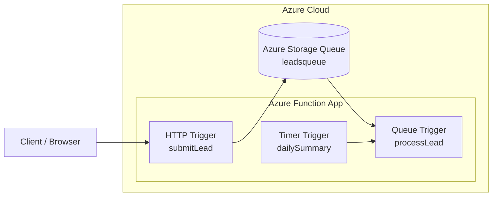

# Azure Functions Lead Processing 

A small serverless Azure Functions project built with the Node.js v4 programming model.

Serverless Azure Functions demo

HTTP → Queue → Worker pattern

## Overview

This project demonstrates a simple business-style workflow using three Azure Functions:

- **submitLead** – HTTP trigger that receives lead data from a browser or client
- **processLead** – Queue trigger that processes lead messages asynchronously
- **dailySummary** – Timer trigger that runs periodically for scheduled background tasks

## Architecture
### Serverless Lead Processing Workflow

This architecture demonstrates an asynchronous serverless workflow using Azure Functions and Azure Storage Queue.
The HTTP-triggered function receives lead data and places it in an Azure Storage Queue.
A queue-triggered function processes the message asynchronously, while a timer-triggered function
runs periodic background tasks.

### Workflow

1. A client sends lead data to the HTTP endpoint.
2. The `submitLead` function validates the request and writes the payload to an Azure Storage Queue.
3. The `processLead` queue-triggered function processes the message asynchronously.
4. The `dailySummary` timer-triggered function runs periodic background tasks.

# Functions
## submitLead  
Receives lead data through HTTP query parameters or JSON body.
Expected fields:  
name  
email   
message   
It validates the request and pushes the payload into Azure Queue Storage.

## processLead  
Triggered automatically when a new message arrives in the queue.

It parses the queued JSON payload and simulates business processing such as:

CRM import  
sales notification  
support workflow  
analytics logging

## dailySummary  
Runs on a timer and simulates scheduled background work such as:
reporting 
housekeeping  
periodic checks

## Example request  
https://functionapp.azurewebsites.net/api/submitLead?name=John&email=john@test.com&message=Interested

# Tehnologies  
- Azure Functions  
- Node.js  
- Azure Storage Queue  
- JavaScript  
- Azure Functions Core Tools

# Local development  
Install dependencies:  
npm install  
func start

# Deploy

func azure functionapp publish <functionapp-name>

# Notes

This project was built as a practical Azure serverless demo and portfolio example.
It shows how to combine:

- HTTP triggers  
- Queue triggers  
- Timer triggers  
- asynchronous processing patterns
