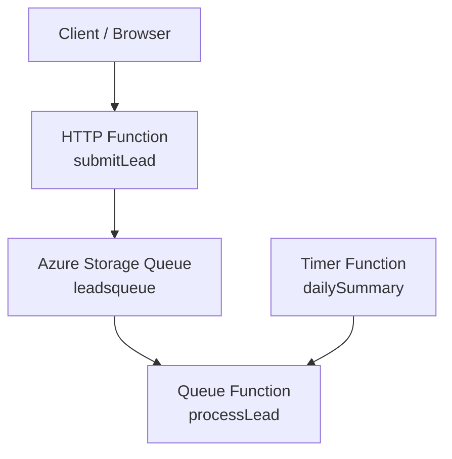

# Azure Functions Lead Processing Demo

A small serverless Azure Functions project built with the Node.js v4 programming model.

## Overview

This project demonstrates a simple business-style workflow using three Azure Functions:

- **submitLead** – HTTP trigger that receives lead data from a browser or client
- **processLead** – Queue trigger that processes lead messages asynchronously
- **dailySummary** – Timer trigger that runs periodically for scheduled background tasks

## Architecture

# Functions
## submitLead

Receives lead data through HTTP query parameters or JSON body.
Expected fields:

name

email

message

It validates the request and pushes the payload into Azure Queue Storage.

## processLead

Triggered automatically when a new message arrives in the queue.

It parses the queued JSON payload and simulates business processing such as:

CRM import

sales notification

support workflow

analytics logging

## dailySummary

Runs on a timer and simulates scheduled background work such as:

reporting

housekeeping

periodic checks

## Example request
/api/submitLead?name=Donald&email=donald@example.com&message=Interested%20in%20Azure

Example response

Lead queued for Donald

# Technologies used

- Azure Functions

- Node.js

- Azure Storage Queue

- JavaScript

- Azure Functions Core Tools

# Local development

Install dependencies:

npm install

Run locally:

func start

# Notes

This project was built as a practical Azure serverless demo and portfolio example.
It shows how to combine:

- HTTP triggers

- Queue triggers

- Timer triggers

- asynchronous processing patterns
